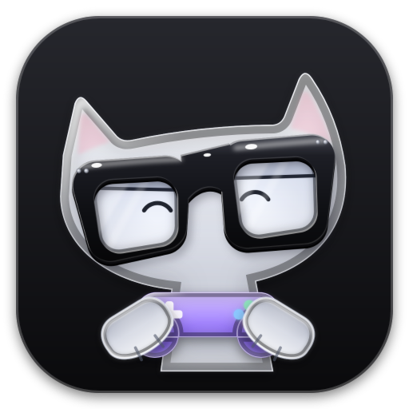
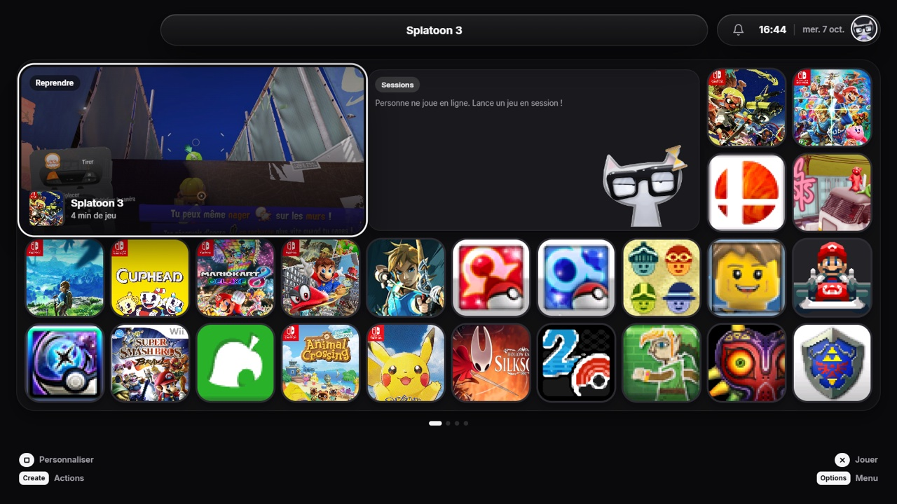
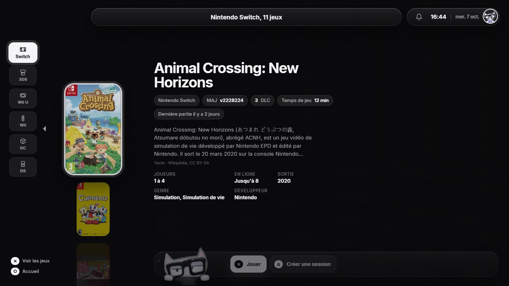
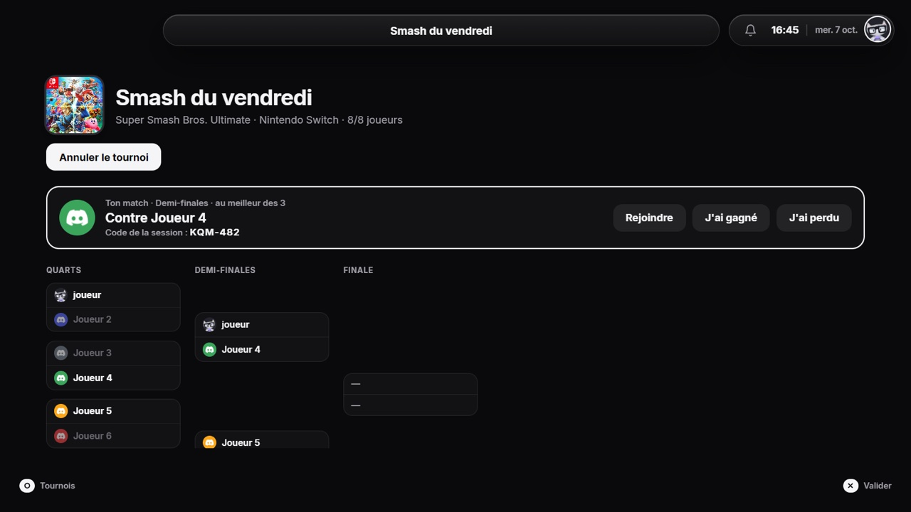
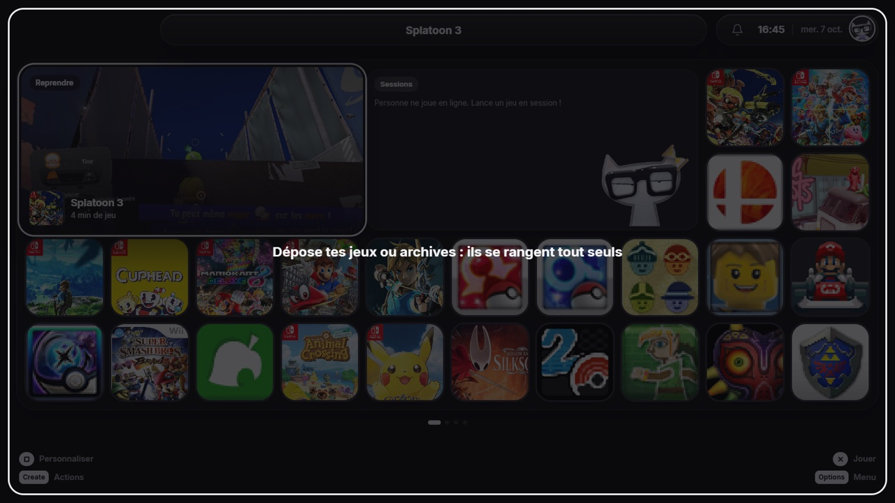
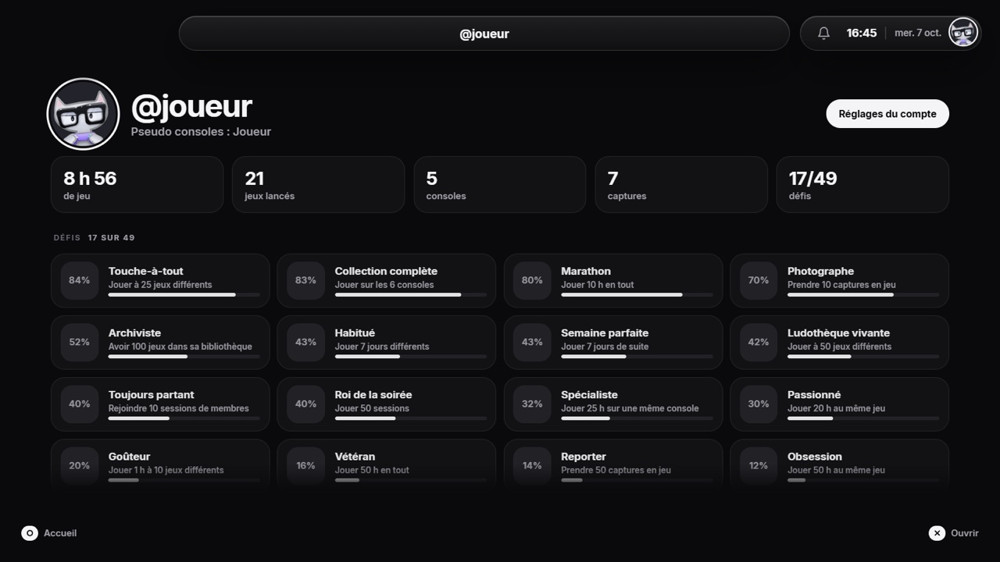

<p align="center"></p>

<h1 align="center">En Local</h1>

<p align="center">L'app du serveur Discord <b>Le Local</b> pour jouer ensemble à vos jeux Nintendo sur PC.</p>

<p align="center"></p>

## Ce que c'est

En Local réunit six consoles dans une seule app pour Windows, pensée comme le menu d'une console et pilotable à la manette.

- **DS, 3DS, GameCube, Wii, Wii U et Switch** : les jeux se lancent dans la fenêtre d'En Local, sans ouvrir d'émulateur à part.
- **Sessions avec un code** : on crée une session, les autres la rejoignent avec un code à 6 caractères, même en pleine partie.
- **Tournois** : un membre organise, les autres s'inscrivent, chaque match se joue dans une session avec son code.
- **Ajouter des jeux** : dépose un jeu ou une archive (.zip, .7z, .rar) sur l'app, il se range tout seul avec ses mises à jour et DLC.
- **Le Local intégré** : qui est en ligne, qui joue à quoi, les jeux de chacun, les invitations et les défis dans un centre de notifications.
- **Profil** : temps de jeu, 49 défis, jeux les plus joués, et un Pokédex qui suit tout ce qui est attrapé dans les jeux Pokémon.
- **Captures et clips** : photo ou clip des dernières secondes avec le bouton de partage de la manette.
- **Réglages simples** : graphismes recommandés selon le PC, touches de la manette, langue, son, par console ou par jeu.

<p align="center">


</p>
<p align="center">


</p>

## Installer

1. Rejoins le serveur Discord **Le Local** : https://loc-lab.fr/rejoindre
2. Télécharge l'installeur sur https://loc-lab.fr/en-local/ (connexion Discord, membres vérifiés du Local).
3. Lance-le. Windows ne connaît pas encore En Local et affiche un avertissement SmartScreen : clique sur « Informations complémentaires », puis « Exécuter quand même ».
4. Au premier lancement, Loc, la mascotte du serveur, te guide : connexion Discord, dossier des jeux, manette, graphismes.

En Local se met ensuite à jour tout seul.

### Ce qu'il te faut

- Windows 10 ou 11 (64 bits), et une manette de préférence.
- Un compte Discord membre vérifié du Local.
- Tes propres jeux : les copies de tes cartouches et de tes disques.
- Switch : les clés (`prod.keys`) et le firmware de ta console. 3DS : le `boot9.bin` de ta console pour les jeux chiffrés. En Local les range pour toi.

**En Local ne fournit aucun jeu, aucune clé, aucun firmware ni aucun BIOS.**

## Comment c'est fait

| Dossier | Contenu |
| --- | --- |
| `proto/ui` | L'interface (HTML, CSS, JavaScript), affichée par WebView2 |
| `proto/src-tauri` | L'app en Rust (Tauri 2) : lancement des émulateurs, manettes, fichiers, réglages |
| `forks` | Les modifications apportées aux émulateurs (fenêtre intégrée, sessions, manettes) |
| `outils` | Scripts de compilation, l'installeur, l'outil Pokédex (C#, PKHeX.Core) |

Les émulateurs utilisés :

- **DS** : melonDS DS (cœur libretro, chargé dans l'app)
- **3DS** : AzaharPlus (fork d'Azahar)
- **GameCube et Wii** : Dolphin
- **Wii U** : Cemu
- **Switch** : Eden

L'app parle à **Loc**, le bot du serveur, pour la connexion Discord, les sessions et les mises à jour.

### Compiler

Il faut Windows, Rust, Node.js et Visual Studio (C++). Puis :

```powershell
cd proto\src-tauri
cargo build --release
```

`outils\installeur.ps1` construit l'installeur complet, avec les émulateurs (compilés à part, voir les scripts `outils\*build*.ps1` et les patchs de `forks`).

## Licence

En Local est sous licence **GPL-3.0** (voir [LICENSE](LICENSE)).

Les composants inclus gardent leur licence : Eden et melonDS (GPL-3.0), Azahar et Dolphin (GPL-2.0 ou plus), Cemu (MPL-2.0), PKHeX.Core (GPL-3.0), FFmpeg (LGPL), nsz (MIT), SDL (zlib), Tauri (MIT / Apache-2.0).

Nintendo, les consoles et les jeux cités appartiennent à leurs propriétaires. En Local n'est ni affilié ni approuvé par Nintendo.
